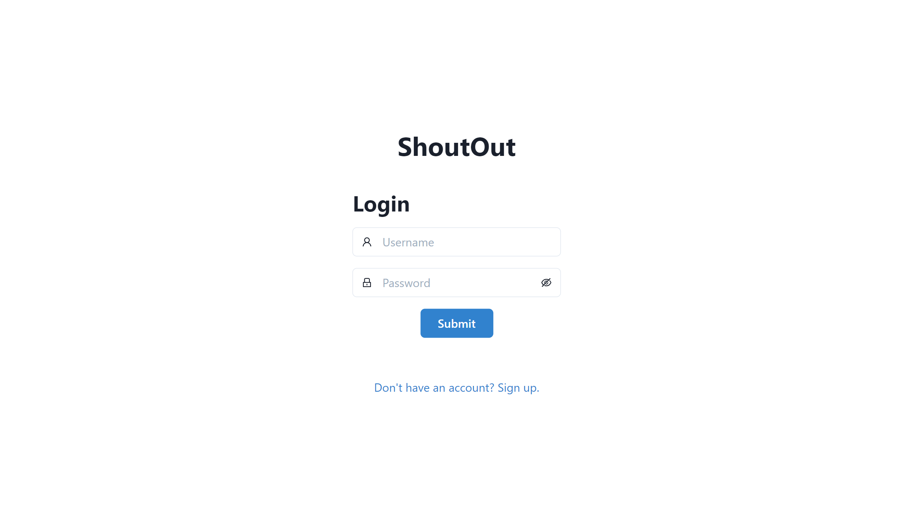
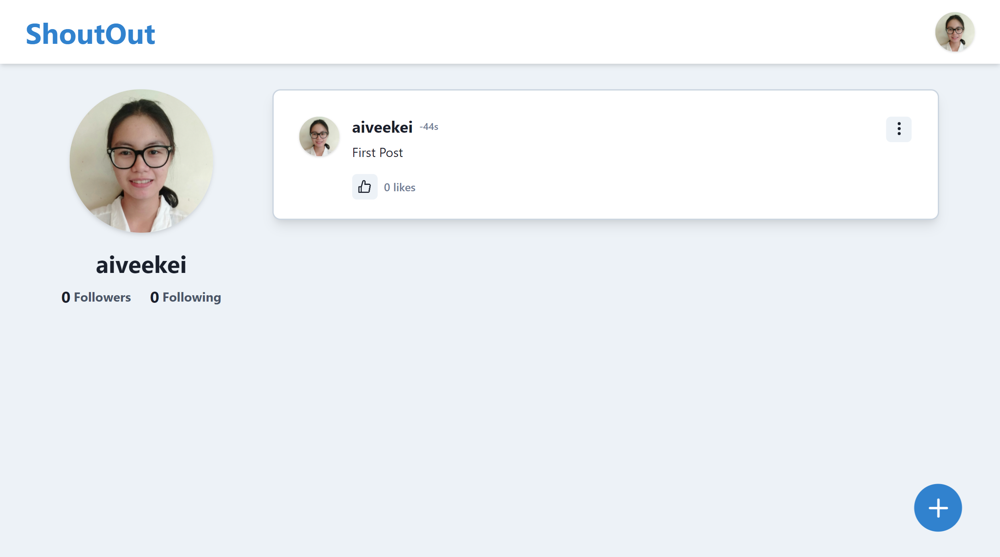
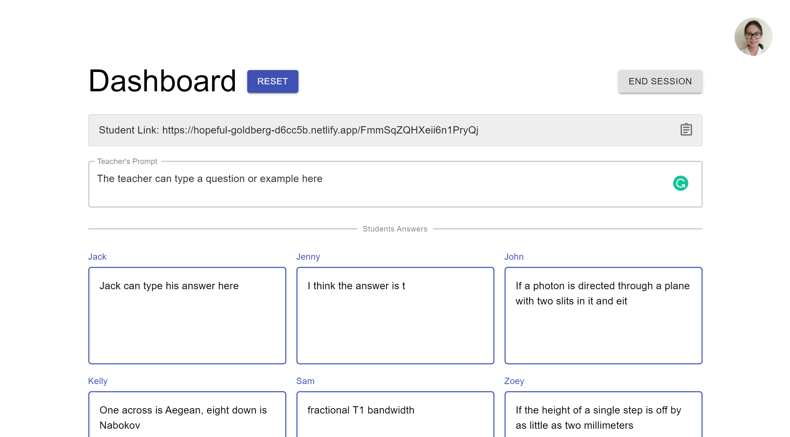
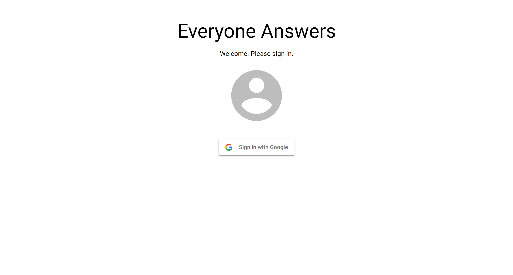
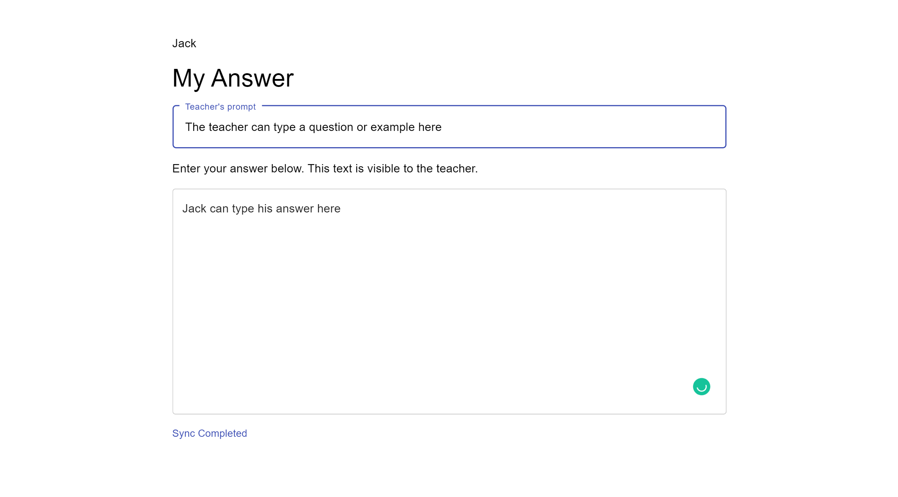
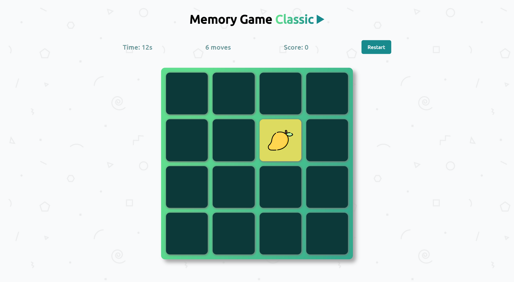
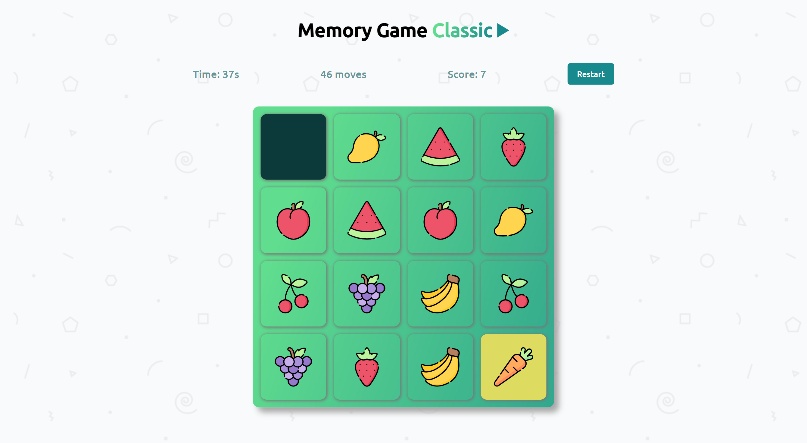
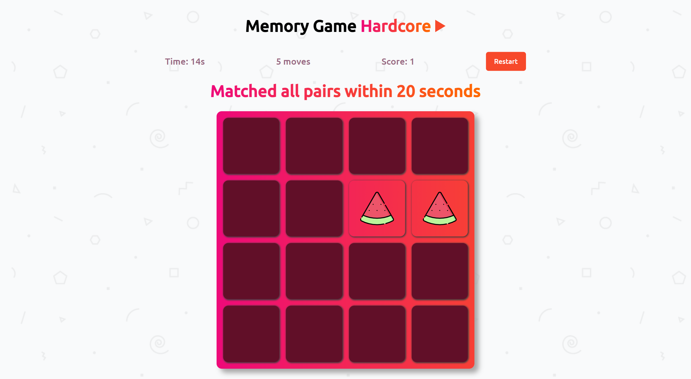
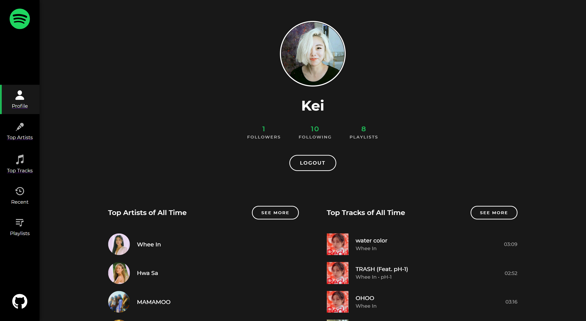

***'The digital world inside our computers works in exact and with calculated ways'***, and that's the mindset I like to have whenever I do my work.

Hi there! I'm Aivee Kei Soriano, a full-stack web developer who takes comfort from the repetitive part of programming and finds excitement from the endless learning in this field. I enjoy building projects, solving problems, and getting things done. I am skilled in MongoDB, ExpressJS, ReactJS, NodeJS and Firebase. I mostly work with the MERN stack but I'm very eager to learn more technologies.

Here are some of the major projects I have build! 🚀🚀

## ShoutOut: Social Media Website | [GitHub Repo](https://github.com/aiveeKeiSoriano/social-media)
### [Website link](https://inspiring-noether-356180.netlify.app/feed)

[GitHub Repo](https://github.com/aiveeKeiSoriano/social-media)

It is a social media website design for people to share their thoughts and follow other people's thoughts. I built it from scratch including authentication, and used JWT for authorization. You can follow other users and it generates a Feed which contains your posts and posts of all the users you are following. You can like a post, view other users’ profile and unfollow them if you want.

Front-end:
- ReactJS
- Redux
- Chakra UI

Back-end API:
- NodeJS 
- ExpressJS 
- Heroku
- MongoDB Atlas database

You can visit the website hosted in Netlify using this [link](https://inspiring-noether-356180.netlify.app/feed)
You can create your own new account or login using *aiveekei* as username and *testpass* as password

**ShoutOut Login Page**

**ShoutOut Profile Page**

## Everyone Answers (Firebase) || [GitHub Repo](https://github.com/aiveeKeiSoriano/everyone-answers/tree/features)
### [Website link](https://hopeful-goldberg-d6cc5b.netlify.app/)

[GitHub Repo](https://github.com/aiveeKeiSoriano/everyone-answers)

It is an app created to help teachers get instant response from students in a live online class.
Teacher can create a session, add students and can share a unique link with students.
When a student opens the portal and answers something, it appears on the teacher's dashboard real time.

Front-end:
- ReactJS
- Redux
- Material UI

Back-end database and authentication:
- Firebase firestore
- Firebase login with Google authentication

Here is a [link](https://hopeful-goldberg-d6cc5b.netlify.app/) to the teacher's dashboard for you to try it.

**Everyone Answers Login Page**

**Everyone Answers Student Page**

## Movies Website
### [Website link](https://blissful-mcclintock-111199.netlify.app).

This is a website to browse and search popular movies and view posters and trailer videos.
Implemented search using a 3rd Party REST API and used routing and pagination to load 20 movies at a time.

Front-end:
- ReactJS

API:
- [TMDB](https://developers.themoviedb.org/3/getting-started/introduction)

You can look at the website [here](https://blissful-mcclintock-111199.netlify.app).

**Movies Website Detailed Page**

## Memory Game
### [Website link](https://kind-ramanujan-6e88de.netlify.app/)

Created a fun time-based memory game using ReactJS.
Using multiple timers on the same page was a challenge.

Here is the [link](https://kind-ramanujan-6e88de.netlify.app/) to play the game, enjoy!

**On Going Memory Game**

**Hardcore Mode**

Unlike the classic mode where you have unlimited tries, in hardcore mode, the player needs to match everything within 20 seconds.

## Spotify Profile
### [Website Link](https://quizzical-poitras-057011.netlify.app/)

It is an app that lets a user login using their existing spotify account. And view their profile, top artists and top tracks.

Front-end:
- ReactJS
- styled-components

API:
- Spotify for developers [Web API](https://developer.spotify.com/documentation/web-api/)

You can look at your profile [here](https://quizzical-poitras-057011.netlify.app/)

**Spotify Profile Top Artists**

