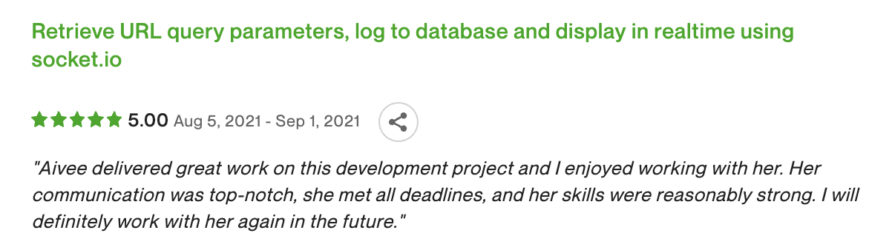
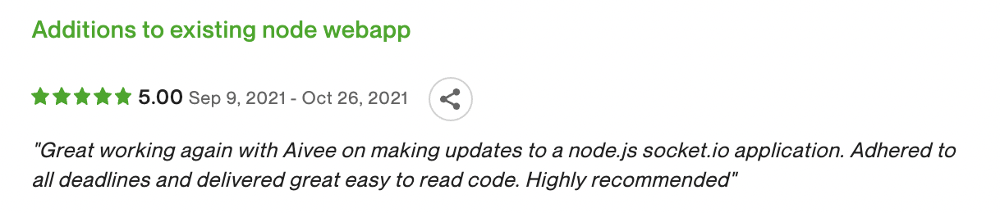
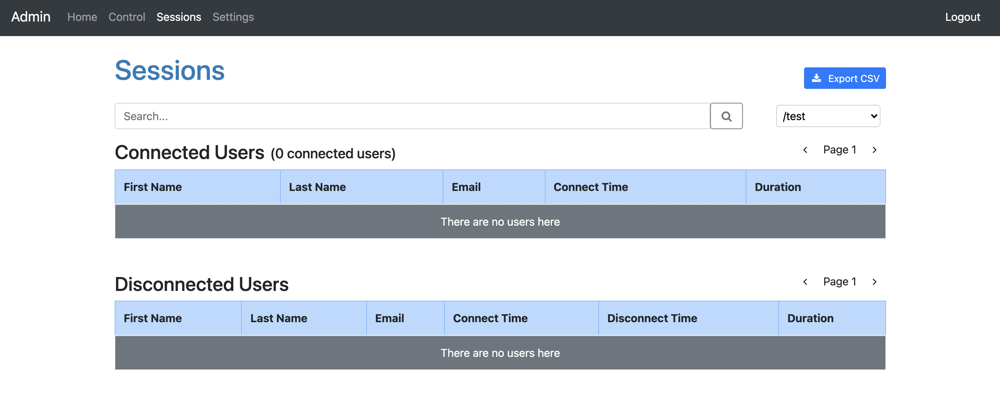
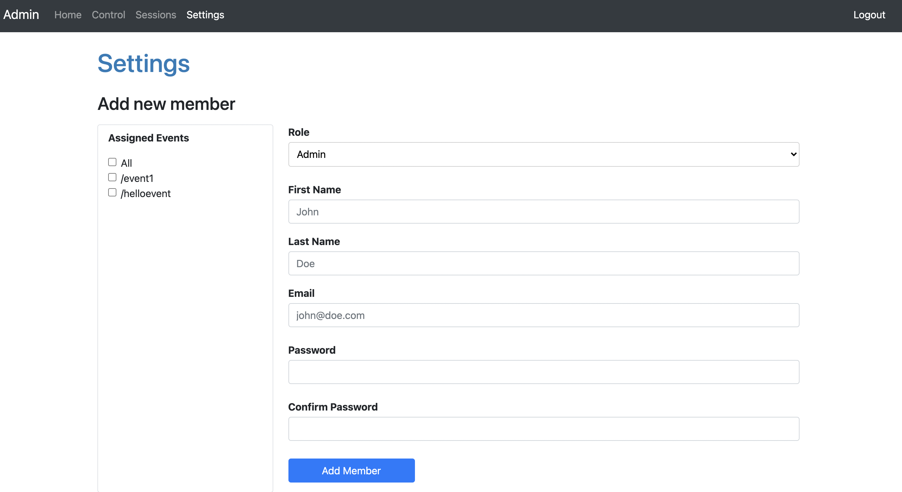
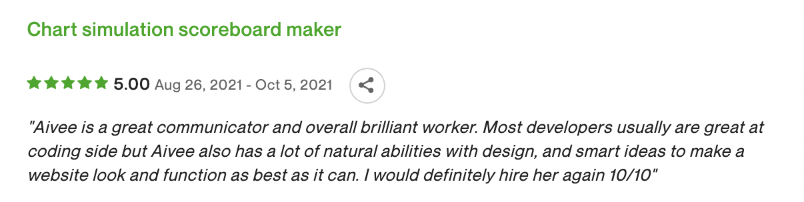

***'The digital world inside our computers works in exact and with calculated ways'***, and that's the mindset I like to have whenever I do my work.

Hi there! I'm Aivee Kei Soriano, a full-stack web developer who takes comfort from the repetitive part of programming and finds excitement from the endless learning in this field. I enjoy building projects, solving problems, and getting things done. I am skilled in MongoDB, ExpressJS, ReactJS, NodeJS and Firebase. I mostly work with the MERN stack but I'm very eager to learn more technologies.

  

Here are what my Upwork clients said about me and my work. 🤗🤗

## NodeJS Admin Dashboard

The back-end server was made using nodeJS and expressJS and serves Pug views as the front-end. The dashboard includes user authentication and 2 level of authorization: admin and viewer. Websocket was used to track users who connects to the website. The data was stored in MongoDB Atlas and displayed in a table at the admin dashboard.

Technologies used: NodeJS, ExpressJS, MongoDB, Pug, Bootstrap, Fast-CSV, Socket.io

## ReactJS Drag and Drop, Automated Song Chart Simulator

In this website, a user can search for songs using title, artists, or albums and the song information will be fetched from Spotify API. Using the list of songs the user chose, the user can drag and drop songs into their preferred position. A user can also add corresponding scores to the songs and on trigger, the website will start a scripted drag-and-drop which will sort the songs in an animated manner.

Technologies used: ReactJS, Material-UI, Styled-components, Redux, Axios, React-beautiful-dnd

And here are some of the major personal projects I have build! 🚀🚀

## ShoutOut: Social Media Website | [Website link](https://inspiring-noether-356180.netlify.app/feed) | [GitHub Repo](https://github.com/aiveeKeiSoriano/social-media)

It is a social media website design for people to share their thoughts and follow other people's thoughts. I built it from scratch including authentication, and used JWT for authorization. You can follow other users and it generates a Feed which contains your posts and posts of all the users you are following. You can like a post, view other users’ profile and unfollow them if you want.

Front-end:
- ReactJS
- Redux
- Chakra UI

Back-end API:
- NodeJS 
- ExpressJS 
- Heroku
- MongoDB Atlas database

You can visit the website hosted in Netlify using this [link](https://inspiring-noether-356180.netlify.app/feed)
You can create your own new account or login using *aiveekei* as username and *testpass* as password

**ShoutOut Login Page**

**ShoutOut Profile Page**

## Everyone Answers (Firebase) | [Website link](https://hopeful-goldberg-d6cc5b.netlify.app/) | [GitHub Repo](https://github.com/aiveeKeiSoriano/everyone-answers/tree/features)

[GitHub Repo](https://github.com/aiveeKeiSoriano/everyone-answers)

It is an app created to help teachers get instant response from students in a live online class.
Teacher can create a session, add students and can share a unique link with students.
When a student opens the portal and answers something, it appears on the teacher's dashboard real time.

Front-end:
- ReactJS
- Redux
- Material UI

Back-end database and authentication:
- Firebase firestore
- Firebase login with Google authentication

Here is a [link](https://hopeful-goldberg-d6cc5b.netlify.app/) to the teacher's dashboard for you to try it.

**Everyone Answers Login Page**

**Everyone Answers Student Page**

## Movies Website | [Website link](https://blissful-mcclintock-111199.netlify.app)

This is a website to browse and search popular movies and view posters and trailer videos.
Implemented search using a 3rd Party REST API and used routing and pagination to load 20 movies at a time.

Front-end:
- ReactJS

API:
- [TMDB](https://developers.themoviedb.org/3/getting-started/introduction)

You can look at the website [here](https://blissful-mcclintock-111199.netlify.app).

**Movies Website Detailed Page**

## Memory Game | [Website link](https://kind-ramanujan-6e88de.netlify.app/)

Created a fun time-based memory game using ReactJS.
Using multiple timers on the same page was a challenge.

Here is the [link](https://kind-ramanujan-6e88de.netlify.app/) to play the game, enjoy!

**On Going Memory Game**

**Hardcore Mode**

Unlike the classic mode where you have unlimited tries, in hardcore mode, the player needs to match everything within 20 seconds.

## Spotify Profile | [Website Link](https://quizzical-poitras-057011.netlify.app/)

It is an app that lets a user login using their existing spotify account. And view their profile, top artists and top tracks.

Front-end:
- ReactJS
- styled-components

API:
- Spotify for developers [Web API](https://developer.spotify.com/documentation/web-api/)

You can look at your profile [here](https://quizzical-poitras-057011.netlify.app/)

**Spotify Profile Top Artists**

