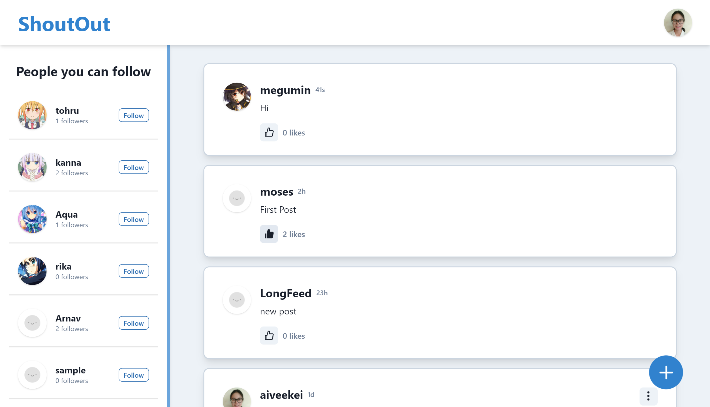
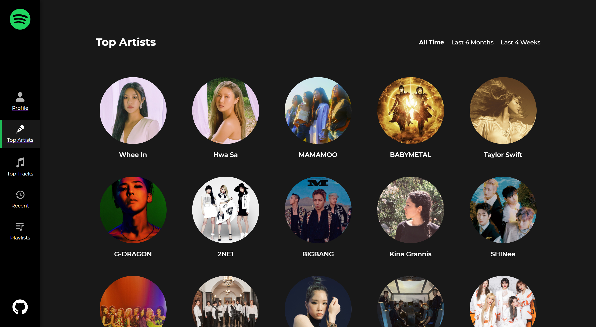

***'The digital world inside our computers works in exact and with calculated ways'***, and that's the mindset I like to have whenever I do my work.

Hi there! I'm Aivee Kei Soriano, a full-stack web developer who takes comfort from the repetitive part of programming and finds excitement from the endless learning in this field. I enjoy building projects, solving problems, and getting things done. I am skilled in MongoDB, ExpressJS, ReactJS, NodeJS and Firebase. I mostly work with the MERN stack but I'm very eager to learn more technologies.

Here are some of the major projects I have build! 🚀🚀

## ShoutOut: Social Media Website 

It is a social media website design for people to share their thoughts and follow other people's thoughts. I built it from scratch including authentication, and used JWT for authorization. You can follow other users and it generates a Feed which contains your posts and posts of all the users you are following. You can like a post, view other users’ profile and unfollow them if you want.

The front-end is made using ReactJS, Redux, and Chakra UI. The back-end API is made using NodeJS and ExpressJS and is currently deployed in Heroku. All the data are stored in MongoDB Atlas database.

You can visit the website hosted in Netlify using this [link](https://inspiring-noether-356180.netlify.app/feed)
You can create your own new account or login using *aiveekei* as username and *testpass* as password

[GitHub Repo](https://github.com/aiveeKeiSoriano/social-media)

**ShoutOut Login Page**

**ShoutOut Profile Page**

## Everyone Answers (Firebase)

It is an app created to help teachers get instant response from students in a live online class.
Teacher can create a session, add students and can share a unique link with students.
When a student opens the portal and answers something, it appears on the teacher's dashboard real time.

It was made with ReactJS with Material UI library, and Redux for the state management. Firebase is used both for storing the sessions and the authentication. It accepts login with Google.

Here is a [link](https://optimistic-agnesi-f901f6.netlify.app/) to the teacher's dashboard for you to try it.

[GitHub Repo](https://github.com/aiveeKeiSoriano/everyone-answers)

**Everyone Answers Login Page**

**Everyone Answers Student Page**

## Movies Website

This is a website to browse and search popular movies and view posters and trailer videos.
Implemented search using a 3rd Party REST API and used routing and pagination to load 20 movies at a time.

You can look at the website [here](blissful-mcclintock-111199.netlify.app).

**Movies Website Detailed Page**

## Memory Game

Created a fun time-based memory game using ReactJS.
Using multiple timers on the same page was a challenge.
Here is the [link](https://kind-ramanujan-6e88de.netlify.app/) to play the game, enjoy!

**On Going Memory Game**

**Hardcore Mode**

Unlike the classic mode where you have unlimited tries, in hardcore mode, the player needs to match everything within 20 seconds.

## Spotify Profile

It is an app that lets a user login using their existing spotify account. It uses the Spotify for Developers Web API for authorization. The UI is made with ReactJS with styled-components.

You can look at your profile [here](https://quizzical-poitras-057011.netlify.app/)

**Spotify Profile Top Artists**

